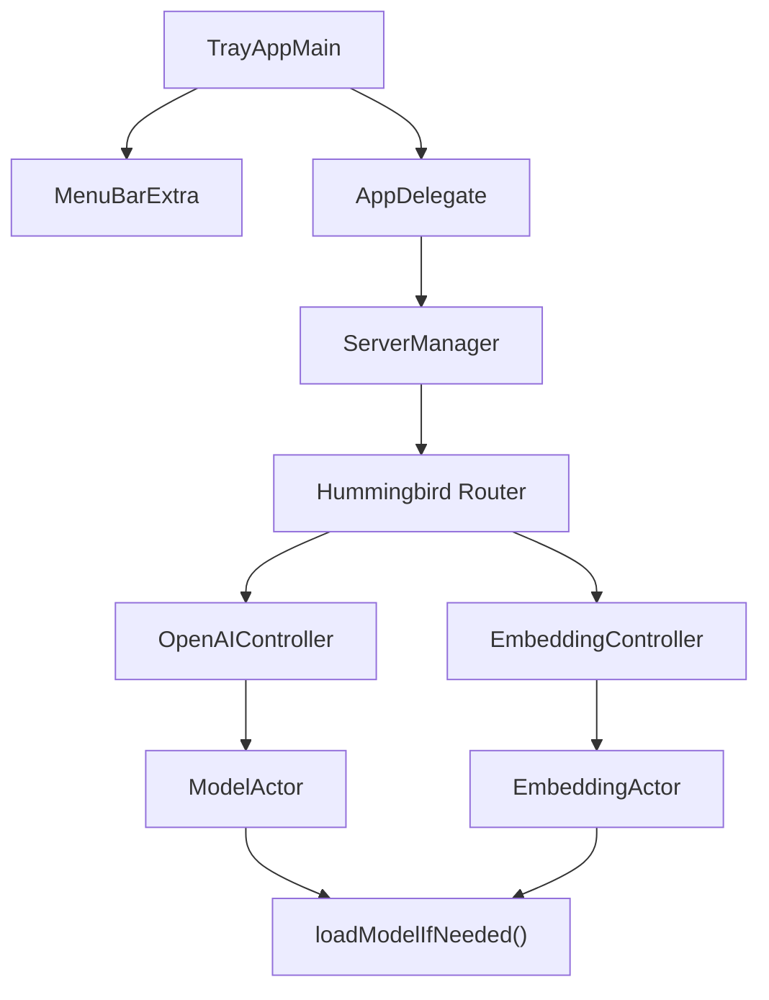

# Tray App Implementation

Documentation for the macOS menu bar (tray) application feature added to Ibex.

## Overview

The `ibex-tray` app provides a macOS menu bar interface for running the Ibex inference server in the background with lazy model loading.

## Files Added

### TrayApp Target

| File | Purpose |
|------|---------|
| [TrayAppMain.swift](file:///Users/mahavirvataliya/projects/swift-llm-api-server/Sources/TrayApp/TrayAppMain.swift) | Main entry point with MenuBarExtra for tray icon |
| [AppDelegate.swift](file:///Users/mahavirvataliya/projects/swift-llm-api-server/Sources/TrayApp/AppDelegate.swift) | Auto-start server on launch, cleanup on quit |
| [ServerManager.swift](file:///Users/mahavirvataliya/projects/swift-llm-api-server/Sources/TrayApp/ServerManager.swift) | Hummingbird server lifecycle management |
| [SettingsView.swift](file:///Users/mahavirvataliya/projects/swift-llm-api-server/Sources/TrayApp/SettingsView.swift) | SwiftUI settings panel for port and directory |

### Configuration

| File | Purpose |
|------|---------|
| [IbexConfig.swift](file:///Users/mahavirvataliya/projects/swift-llm-api-server/Sources/ibex/IbexConfig.swift) | Persistent settings using UserDefaults |

## Files Modified

### Lazy Model Loading

| File | Changes |
|------|---------|
| [ModelActor.swift](file:///Users/mahavirvataliya/projects/swift-llm-api-server/Sources/ibex/Inference/ModelActor.swift) | Added `loadModelIfNeeded()` for on-demand loading |
| [EmbeddingActor.swift](file:///Users/mahavirvataliya/projects/swift-llm-api-server/Sources/ibex/Inference/EmbeddingActor.swift) | Added `loadModelIfNeeded()` for on-demand loading |
| [OpenAIController.swift](file:///Users/mahavirvataliya/projects/swift-llm-api-server/Sources/ibex/Controllers/OpenAIController.swift) | Triggers lazy load before inference |
| [EmbeddingController.swift](file:///Users/mahavirvataliya/projects/swift-llm-api-server/Sources/ibex/Controllers/EmbeddingController.swift) | Triggers lazy load before inference |

### Package Configuration

| File | Changes |
|------|---------|
| [Package.swift](file:///Users/mahavirvataliya/projects/swift-llm-api-server/Package.swift) | Added `ibex-tray` executable target |

## Build & Run

```bash
# Build
swift build --product ibex-tray

# Run
.build/debug/ibex-tray
```

## Architecture



## Key Features

1. **Lazy Loading**: Server starts without loading models. Models load on first request.
2. **Settings UI**: Configure port and model directory via SwiftUI panel.
3. **Menu Bar Status**: Icon reflects server state (brain/brain.fill).
4. **Auto-Start**: Server starts automatically when tray app launches.
